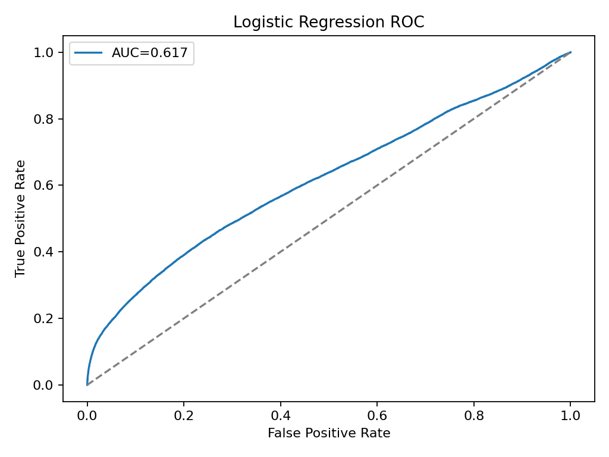
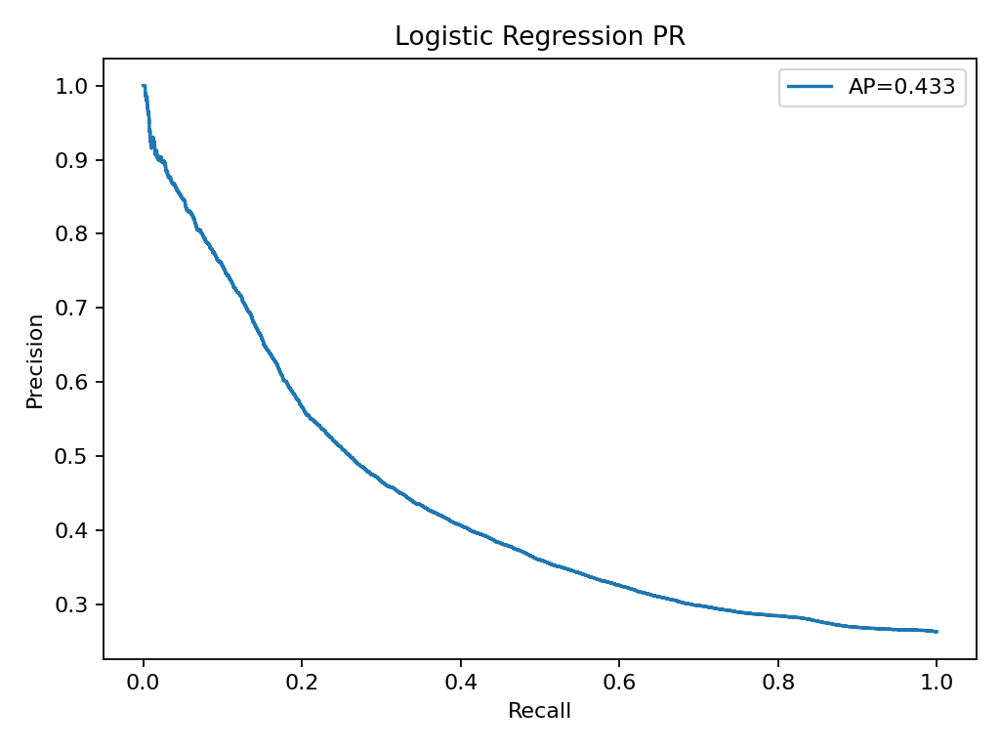
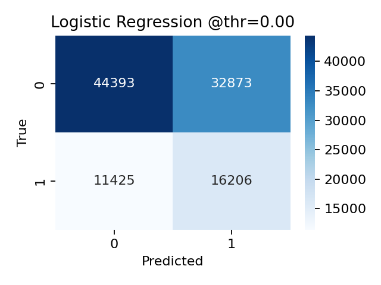

# 🛠️ IoT-Based Machine Fault Detection & Predictive Maintenance

[](https://www.python.org/)
[](https://streamlit.io/)
[](https://scikit-learn.org/)
[](LICENSE)
[]()

> **An end-to-end Industrial IoT (IIoT) predictive maintenance system that analyzes multi-channel sensor telemetry from turbofan engines to forecast Remaining Useful Life (RUL) and detect impending system failures prior to catastrophic breakdown.**

---

## 📌 Executive Summary

Unplanned industrial equipment downtime costs manufacturers billions annually. This project implements a complete, data-driven Predictive Maintenance (PdM) pipeline using high-frequency sensor readings from the **NASA Commercial Modular Aero-Propulsion System Simulation (C-MAPSS)** dataset.

By continuously monitoring 21 sensor streams across variable operating conditions, the system classifies unit health in real time, alerts operators before critical thresholds are breached, and quantifies business return-on-investment (ROI) through cost-benefit simulations.

---

## 🌟 Key Features

- **Multi-Sensor Telemetry Ingestion**: Processes 21 sensor dimensions (combustor temperatures, spool speeds, pressure ratios, bypass ratios) alongside 3 operating condition settings across 4 distinct operational regimes (FD001–FD004).
- **Automated Preprocessing & Normalization**: Scalable feature normalization per sub-dataset, handling multi-modal operational distributions and parquet-compressed serialization.
- **Predictive Fault Modeling**: Probabilistic classification tuned for early warning detection, minimizing high-penalty false negatives.
- **Interactive Streamlit Operations Dashboard**:
  - Live unit drilldown & real-time sensor anomaly inspection.
  - Interactive decision threshold tuner with real-time confusion matrix updates.
  - Predictive risk scores and fleet-wide health status matrices.
- **Automated Executive Reporting**: Generates downloadable diagnostic PDF reports detailing unit risk and fleet-wide metrics using ReportLab.
- **Financial ROI & Business Case Simulation**:
  - Compares unplanned catastrophic failure penalties against scheduled preventative maintenance.
  - Achieved **$112.98M in simulated fleet savings** over the test horizon.

---

## 🏗️ System Architecture

```text
┌─────────────────────────────────┐
│     NASA C-MAPSS Telemetry      │
│ (21 Sensors + 3 Oper. Settings) │
└────────────────┬────────────────┘
                 │
                 ▼
┌─────────────────────────────────┐
│      ETL & Preprocessing        │
│   • RUL Label Engineering       │
│   • Per-dataset MinMax Scaling  │
│   • Parquet File Serialization  │
└────────────────┬────────────────┘
                 │
                 ▼
┌─────────────────────────────────┐
│       Machine Learning          │
│   • Hyperparameter Tuning       │
│   • Threshold Optimization      │
│   • Artifact Serialization      │
└────────┬───────────────┬────────┘
         │               │
         ▼               ▼
┌─────────────────┐  ┌──────────────────┐
│ Streamlit Cloud │  │ PDF Report Engine│
│ Live Dashboard  │  │   (ReportLab)    │
└─────────────────┘  └──────────────────┘
```

---

## 📊 Dataset & Operational Subsets

The solution is evaluated on the benchmark NASA Turbofan Engine Degradation Simulation (C-MAPSS) datasets:

| Dataset | Operating Conditions | Fault Modes | Training Trajectories | Test Trajectories |
| :--- | :--- | :--- | :--- | :--- |
| **FD001** | Sea Level (1) | HPC Degradation (1) | 100 engines | 100 engines |
| **FD002** | Six Conditions (6) | HPC Degradation (1) | 260 engines | 259 engines |
| **FD003** | Sea Level (1) | HPC & Fan Degradation (2) | 100 engines | 100 engines |
| **FD004** | Six Conditions (6) | HPC & Fan Degradation (2) | 249 engines | 248 engines |

---

## 📈 Model Performance & Business Impact

### 1. Classification Metrics
- **ROC-AUC Score**: `0.617`
- **Precision-Recall AUC**: `0.433`
- **Optimized Probability Threshold**: `0.0027` (prioritizes high recall to mitigate catastrophic failure penalties)

### 2. Business Case & ROI Analysis
Using industrial maintenance benchmark parameters:
- **Unplanned Failure Penalty:** \$10,000 / incident
- **Preventative Maintenance Cost:** \$1,000 / inspection

```text
Baseline (Run-to-Failure) Cost : $276,310,000
Predictive Maintenance Cost     : $163,329,000
-----------------------------------------------
Net Simulated Cost Savings      : $112,981,000 (~40.9% Reduction)
```

### 3. Diagnostic Visualizations

<p align="center">
  
  
  
</p>

---

## 📂 Repository Structure

```text
├── .streamlit/
│   └── config.toml             # Custom UI theme settings
├── Data/                       # Raw C-MAPSS NASA engine telemetry files
│   ├── train_FD001..FD004.txt
│   ├── test_FD001..FD004.txt
│   └── RUL_FD001..FD004.txt
├── outputs/
│   ├── artifacts/              # Serialized models, scalers, and metrics
│   │   ├── model.pkl
│   │   ├── scaler.pkl
│   │   ├── feature_names.json
│   │   ├── metrics.json
│   │   └── business_case.json
│   ├── figures/                # Performance plots (ROC, PR, Confusion Matrix)
│   ├── processed_data/         # Parquet optimized datasets
│   └── reports/                # Generated executive PDF report
├── dashboard.py                # Streamlit web application & telemetry viewer
├── project_pipeline.py         # End-to-end data processing & model training script
├── requirements.txt            # Python dependencies
├── .gitignore                  # Git ignore rules
├── LICENSE                     # MIT License
└── README.md                   # Project documentation
```

---

## 🚀 Quickstart Guide

### 1. Clone the Repository
```bash
git clone https://github.com/chakalisairam14/iot-fault-detection.git
cd iot-fault-detection
```

### 2. Set Up a Virtual Environment
```bash
# Windows
python -m venv .venv
.venv\Scripts\activate

# macOS / Linux
python3 -m venv .venv
source .venv/bin/activate
```

### 3. Install Dependencies
```bash
pip install -r requirements.txt
```

### 4. Run the Streamlit Dashboard
```bash
streamlit run dashboard.py
```
Open your browser at `http://localhost:8501` to explore the telemetry data, test probability thresholds, and inspect machine health.

### 5. (Optional) Re-run the Training Pipeline
To retrain models and regenerate all artifacts and reports:
```bash
python project_pipeline.py --data_dir Data --out_dir outputs --fds FD001 FD002 FD003 FD004
```

---

## 🌐 Deploy to Cloud (Streamlit Community Cloud)

1. Fork or push this repository to your GitHub account.
2. Visit **[share.streamlit.io](https://share.streamlit.io/)** and sign in with GitHub.
3. Click **New App**, select this repository, set the branch to `main`, and enter `dashboard.py` as the entry file.
4. Click **Deploy!**

---

## 🛠️ Tech Stack

- **Application & Visualization**: [Streamlit](https://streamlit.io/), [Plotly](https://plotly.com/python/), [Dash Bootstrap Components](https://dash-bootstrap-components.opensource.faculty.ai/)
- **Machine Learning**: [Scikit-learn](https://scikit-learn.org/), [Joblib](https://joblib.readthedocs.io/)
- **Data Engineering**: [Pandas](https://pandas.pydata.org/), [NumPy](https://numpy.org/), [PyArrow / Parquet](https://arrow.apache.org/)
- **Reporting**: [ReportLab](https://www.reportlab.com/)

---

## 📄 License

This project is licensed under the [MIT License](LICENSE) - see the LICENSE file for details.
